# :zap: Ionic Country Data

Ionic 5 app that displays data about countries and oceans from the [Rest Countries](https://restcountries.eu/) API, a [Google Maps](https://cloud.google.com/maps-platform/maps/) API and a local json file

## :page_facing_up: Table of contents

* [General info](#general-info)
* [Screenshots](#screenshots)
* [Technologies](#technologies)
* [Setup](#setup)
* [Features](#features)
* [Status](#status)
* [Inspiration](#inspiration)
* [Contact](#contact)

## :books: General info

* The [Rest Countries API](https://restcountries.eu/) has a number of endpoints that can be used to search for info. I have used the endpoints: All, Name & Region. The [API Response Example](https://restcountries.eu/#api-endpoints-response-example) was useful to create my http interface classe.
* The [Google Maps](https://cloud.google.com/maps-platform/maps/) API displays an interactive map of the chosen country that the user can zoom in and out of.
* Built using the [Ionic 5 framework](https://ionicframework.com/docs)

## :camera: Screenshots

| 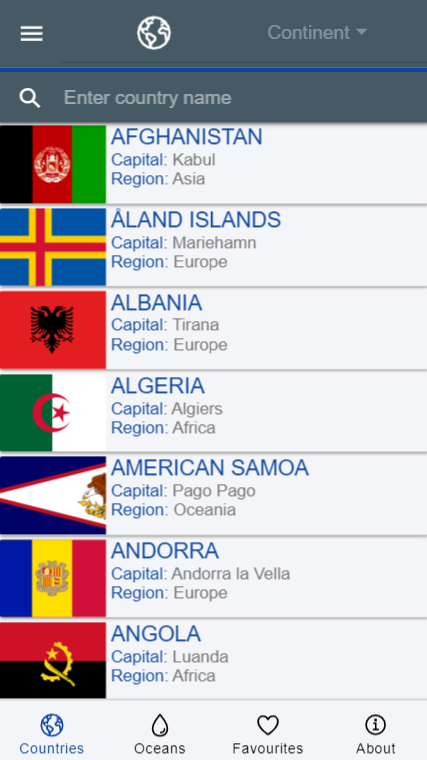 | 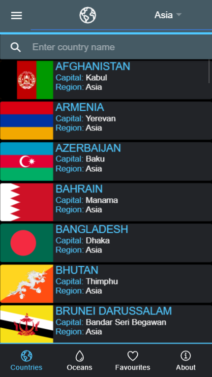 | 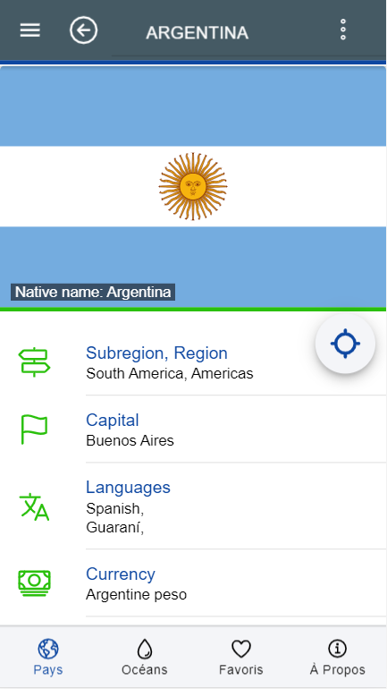 |
|:---:|:---:|:---:|
| Country-List Page | Country-List Page - Dark | Country-List - Detail |

|  | 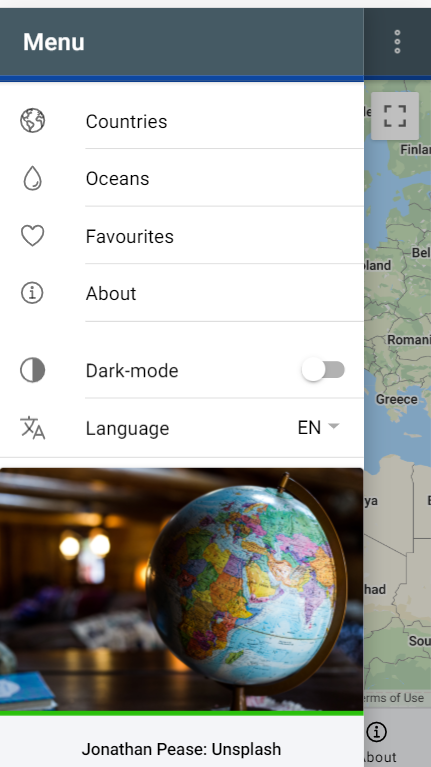 | 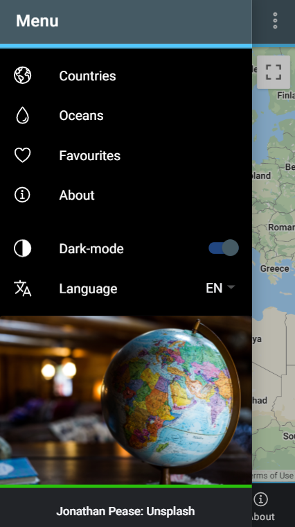 |
|:---:|:---:|:---:|
| Map View Page | Side Menu | Side Menu - Dark |

| 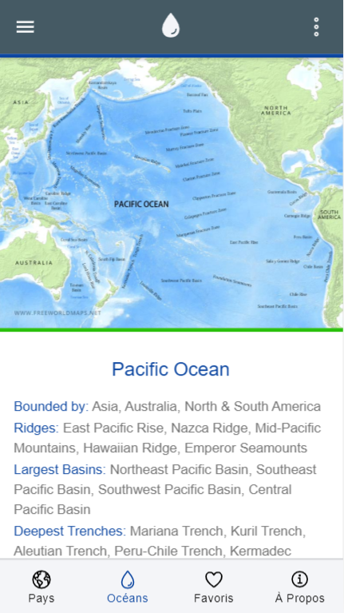 | 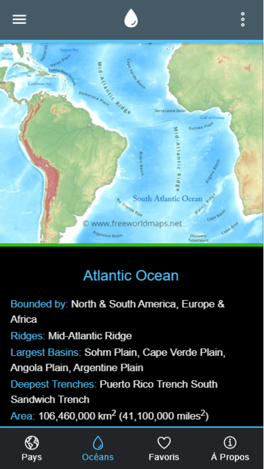 | 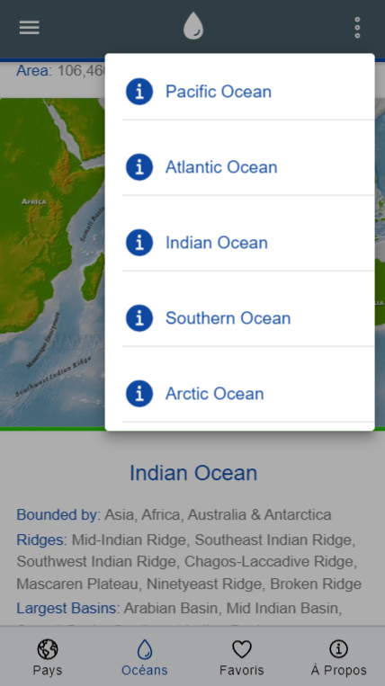 |
|:---:|:---:|:---:|
| Oceans-List Page | Oceans Page - Dark| Oceans Page + Popover |

| 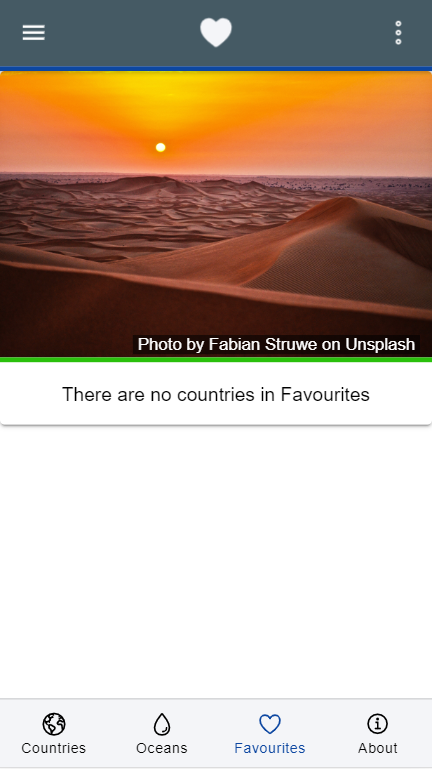 | 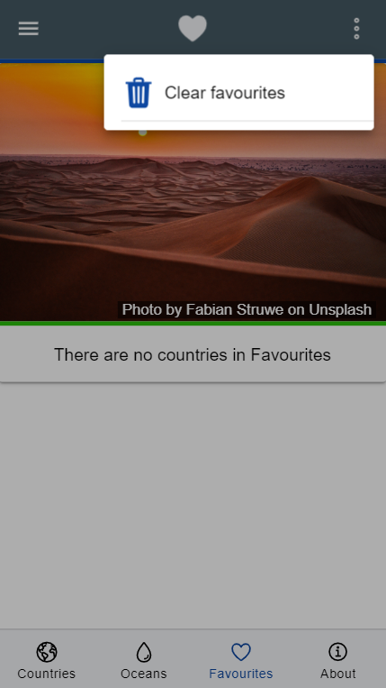 | 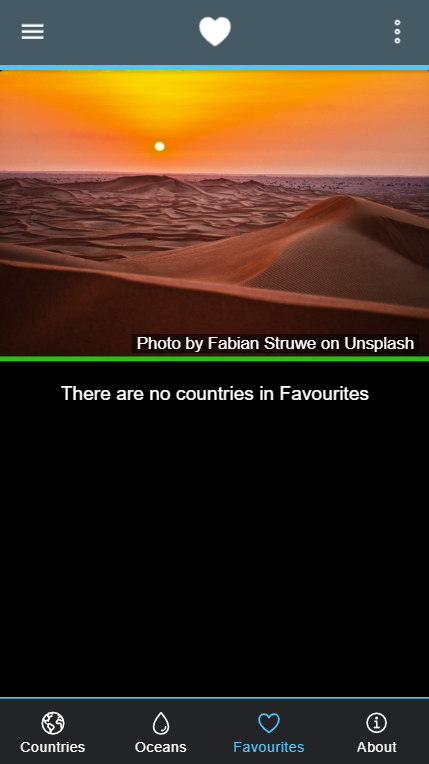 |
|:---:|:---:|:---:|
| Favourites Page | Favourites Page + Popover | Favourites Page - Dark |

| 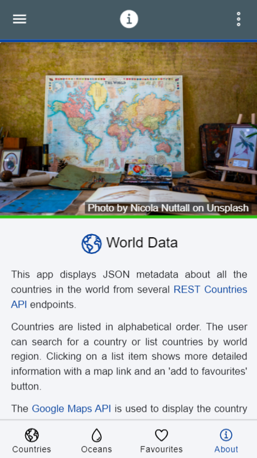 | 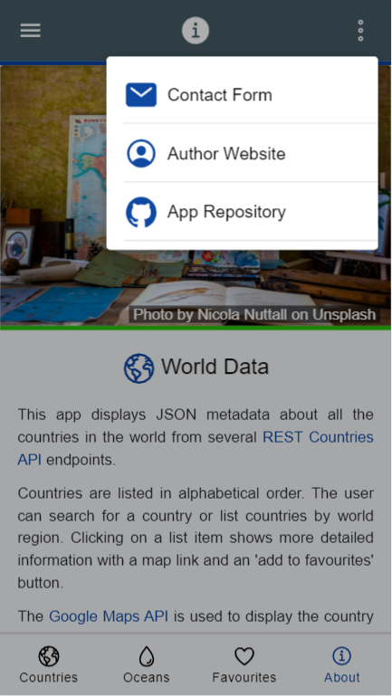 | 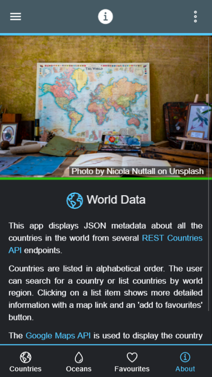 |
|:---:|:---:|:---:|
| About Page | About Page + Popover | About Page - Dark |

## :signal_strength: Technologies

* [Ionic v5](https://ionicframework.com/)
* [Angular v10](https://angular.io/)
* [Ionic/angular v5](https://www.npmjs.com/package/@ionic/angular)
* [Rest Countries API v2](https://restcountries.eu/)
* [Google Maps API](https://developers.google.com/chart/interactive/docs/gallery/map)
* [Ionic 5 open source Ionicons](https://ionicons.com/)

## :floppy_disk: Setup

* Run `npm i` to install dependencies
* To start the server on _localhost://8100_ type: 'ionic serve'
* To run linter: `npm run lint`
* To create a build file suitable for Firebase deployment: `ionic build --prod --release`
* To deploy to Firebase: `firebase deploy`

## :computer: Code Examples

* service function to fetch API country details, from `rest-api.service.ts`

```typescript
fetchCountryDetailData(country: string) {
  return this.httpClient.get(`${apiUrl}/name/${country}?fullText=true`).pipe(
    map((data: CountryDetailInterface[]) => {
      return data;
    }), catchError( error => {
      return throwError( 'Country not found' );
    })
  )
}
```

## :cool: Features

* **integrated Google Chart Maps** API to show country map.
* **Typescript interface** used to define the expected structures of the json objects returned from the API.
* **Separate services** page with API http fetch functions.
* **RxJS Observables** used to extract data asynchronously.
* **Dark mode** switch on menu.
* **Offline Storage**  (future) of favourite countries/oceans using Ionic Storage.
* **Localisation using i18n** so user can select between English (default), Spanish and French.
* **ion-grid** with fixed column size used so country content data will display ok even on a PC.
* **search** function to search for country name with regex to only allow letters in search text.

## General/Navigation/Pages

* **General:** i18n Translation part-complete
* **TODO:**
* Correct language check so it does revert to English when EN selected - use storage

* **Nav side-bar:** countries, oceans, favorites, about, change language, dark theme toggle + Unsplash image with credit. Languages added.
* **TODO** Add language for alert cancel?

* **Countries page:** Displays mat-card list of countries, displaying country flag, title, capital and region, for 'all' and 5 region sub-categories. Clicking on a country list item will show the country detail (no routing required - all done using *ngIf in the html content :-)). Country searchbar to search by country name. Fab icon link to map of country, generated using the Google Maps API.
* **TODO:**
* Make fab button stay inside div
* add function to convert border country 3 letter codes to full country names.
* add function (custom pipe) to insert ',' in area figures etc.
* translate: popup continent names, card: capital region

* **Oceans page** Displays a mat-card for each ocean using data from a local json file and an *ngFor loop. Menu popover with links to further info for each ocean. It was decided not to add 'favourites functionality' as there are only 5 oceans and they are easy to find.
**TODO**
* Add Ionic accordian? or popover with ocean names listed

* **Favourites** Shows a nice image with text below if there are no favourites
**TODO**
* Add code to store/clear favourites

* **About** Displays Unsplash image with author credit and short info about the app with links to APIs used. Header includes popover with working links to Author Website, Github Repo & author website contact page

## :clipboard: Status & To-do list

* Status: Working & deployed to Firebase.

## :clipboard: To-do

1. replace any types with models
2. Dark theme - add storage
3. Check translations
4. Splash screen
5. SqLite - use as default database?
6. Search page - add or remove Search page.
7. Lighthouse score?
8. Run on simulator

## :clap: Inspiration

* [Ionic Academy Tutorial: How to Localise Your Ionic App with ngx-translate](https://ionicacademy.com/localise-ionic-ngx-translate/) however language selected using ion-select-option dropdown list in side-menu (ie not using a popover page)
* [Devpato article: Setup Google Map in Angular app (The pro way)](https://dev.to/devpato/setup-google-map-in-angular-app-the-pro-way-3m9p)

## :envelope: Contact

* Repo created by [ABateman](https://www.andrewbateman.org) - you are welcome to [send me a message](https://andrewbateman.org/contact)
