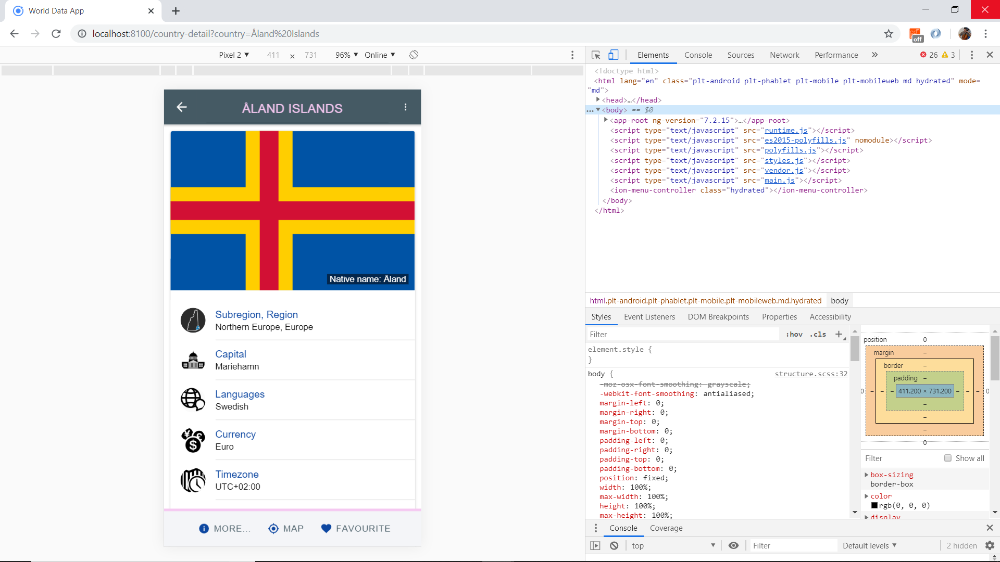
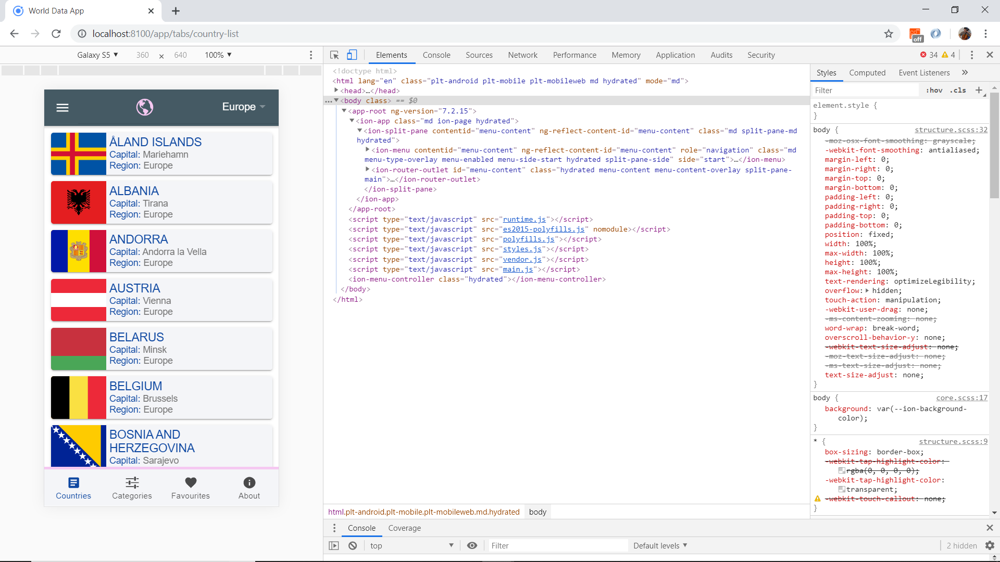

# Ionic Country Data

App that displays details about countries using data from the [Rest Countries](https://restcountries.eu/), using the [Ionic 5 framework](https://ionicframework.com/docs).

## Table of contents

* [General info](#general-info)
* [Screenshots](#screenshots)
* [Technologies](#technologies)
* [Setup](#setup)
* [Features](#features)
* [Status](#status)
* [Inspiration](#inspiration)
* [Contact](#contact)

## General info

* The [Rest Countries API](https://restcountries.eu/) has a lot more detailed functionality available:

## Screenshots



## Technologies

* [Ionic v5.0.0](https://ionicframework.com/)
* [Angular v7.2.2](https://angular.io/)
* [Ionic/angular v4.1.0](https://www.npmjs.com/package/@ionic/angular)
* [Rest Countries API](https://restcountries.eu/)
* [Ionic 4 open source Ionicons](https://ionicons.com/)

## Setup

* To start the server on _localhost://8100_ type: 'ionic serve'

## Code Examples

* tba.

```typescript
tba
```

## Features

* Displays mat-card list of countries with country flag, title, capital and region.
* (future) search bar to search for country from list.
* (future) clicking on the More Info button will route to a detailed info page.
* (future) clicking on the Map button will route to a (Google) Map view of the country.
* **Typescript interface** used to define the expected structures of the json objects returned from the IP and news APIs.
* **Separate services** page with API http fetch functions.
* **Dark mode** (future) switch on menu changes from light to dark mode.
* **Offline Storage** of favourite articles using Ionic Storage.
* **Common Progess Bar Component** ion-card shows while news loading on News, Categories and Favourites pages.
* **Localisation using i18n** so user can select between English (default), Spanish and French.

## Navigation/Pages

* **Nav side-bar:** countries, categories, favorites, search, about, change language, dark theme toggle + Unsplash image with credit. Change color of tabs bar - add blue top border??
* **TODO** add menu close function.

* **Countries page:** Simple list of cards working for 'all' and all region categories.
**TODO:** Include search bar at top. footer: link to search??

* **Country Detail page:** ion-list displays country details from API. Tab bar at bottom has links to more info, map and add to favourites.

* **Categories** Replace with search? 

* **Favourites** Add code to store favourites.

* **About** TODO

## Status & To-do list

* Status: Working. See sections above.

* To-do: Look at CIA Fact Book for info - API? -  add link?

## Inspiration

* [Ionic Academy Tutorial: How to Localise Your Ionic App with ngx-translate](https://ionicacademy.com/localise-ionic-ngx-translate/) however language selected using ion-select-option dropdown list in side-menu (ie not using a popover page).

## Contact

Repo created by [ABateman](https://www.andrewbateman.org) - feel free to contact me!
