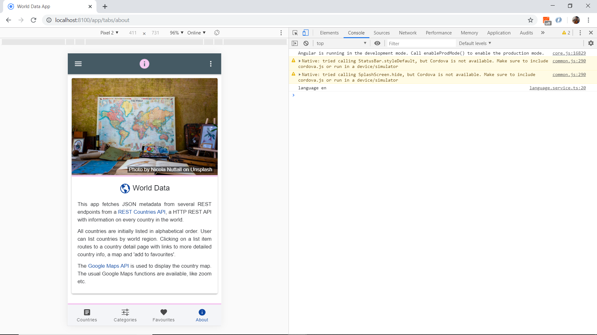

# Ionic Country Data

App that displays details about countries using data from the [Rest Countries](https://restcountries.eu/), using the [Ionic 5 framework](https://ionicframework.com/docs).

## Table of contents

* [General info](#general-info)
* [Screenshots](#screenshots)
* [Technologies](#technologies)
* [Setup](#setup)
* [Features](#features)
* [Status](#status)
* [Inspiration](#inspiration)
* [Contact](#contact)

## General info

* The [Rest Countries API](https://restcountries.eu/) has a lot more detailed functionality available:

## Screenshots




## Technologies

* [Ionic v5.0.0](https://ionicframework.com/)
* [Angular v7.2.2](https://angular.io/)
* [Ionic/angular v4.1.0](https://www.npmjs.com/package/@ionic/angular)
* [Rest Countries API v2.0.5](https://restcountries.eu/)
* [Ionic 4 open source Ionicons](https://ionicons.com/)

## Setup

* To start the server on _localhost://8100_ type: 'ionic serve'

## Code Examples

* service function to fetch API country details, from `rest-api.service.ts`

```typescript
fetchCountryDetailData(country: string) {
  return this.httpClient.get(`${apiUrl}/name/${country}?fullText=true`).pipe(
    map((data: CountryDetailInterface[]) => {
      return data;
    }), catchError( error => {
      return throwError( 'Country not found' );
    })  
  )
}
```

## Features

* (future) integrated Google Maps API.
* **Typescript interface** used to define the expected structures of the json objects returned from the API.
* **Separate services** page with API http fetch functions.
* **RxJS Observables** used to extract data asynchronously.
* **Dark mode** (future) switch on menu changes from light to dark mode.
* **Offline Storage** of favourite articles using Ionic Storage.
* **Common Progess Bar Component** ion-card shows while country info loading.
* **Localisation using i18n** so user can select between English (default), Spanish and French.
* **ion-grid** with fixed column size used so country data will display ok even on a PC.

## Navigation/Pages

* **Nav side-bar:** countries, categories, favorites, search, about, change language, dark theme toggle + Unsplash image with credit. Change color of tabs bar - add blue top border??
* **TODO** add menu close function.
* **TODO** search bar in header to search for country from list.

* **Countries page:** Working. Displays mat-card list of countries, displaying country flag, title, capital and region, for 'all' and 5 region sub-categories. Clicking on a country list item will show the country detail ( no routing required - all done using *ngIf in the html content).
**TODO:** Add filter in API fetch pipe method to separte out each region into its own array - saves http calls. Correct error message with name. Stop scroll when user reached the bottom. Include search bar at top. footer: link to search? Add floating button to add to favourites? Add code so Map button will route to a (Google) Map view of the country.

* **Search** Change function or remove. Header done.

* **Favourites** Add code to store favourites?

* **About** Working. Displays Unsplash image with author credit and short info about the app with links to APIs used. Header includes popover with links to Author Website, Github Repo and a Contact Page. 
**TODO:** add popover links, including contact page with thumbnail image.

## Status & To-do list

* Status: Working. See sections above.

* To-do: Look at CIA Fact Book for info - API? -  add link?

## Inspiration

* [Ionic Academy Tutorial: How to Localise Your Ionic App with ngx-translate](https://ionicacademy.com/localise-ionic-ngx-translate/) however language selected using ion-select-option dropdown list in side-menu (ie not using a popover page).

## Contact

Repo created by [ABateman](https://www.andrewbateman.org) - feel free to contact me!
