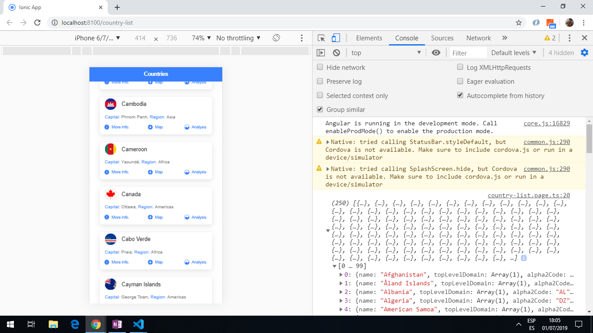

# Ionic Country Data

App that displays details about countries using data from the [Rest Countries](https://restcountries.eu/), using the [Ionic 5 framework](https://ionicframework.com/docs).

## Table of contents

* [General info](#general-info)
* [Screenshots](#screenshots)
* [Technologies](#technologies)
* [Setup](#setup)
* [Features](#features)
* [Status](#status)
* [Inspiration](#inspiration)
* [Contact](#contact)

## General info

* The [Rest Countries API](https://restcountries.eu/) has a lot more detailed functionality available:

## Screenshots



## Technologies

* [Ionic v5.0.0](https://ionicframework.com/)

* [Angular v7.2.2](https://angular.io/)

* [Ionic/angular v4.1.0](https://www.npmjs.com/package/@ionic/angular)

* [Rest Countries API](https://restcountries.eu/)

## Setup

* To start the server on _localhost://8100_ type: 'ionic serve'

## Code Examples

* tba.

```typescript
tba
```

## Features

* Displays list of countries with country flag, title, capital and region.

* (future) search bar to search for country from list.

* (future) clicking on the More Info button will route to a detailed info page.

* (future) clicking on the Map button will route to a (Google) Map view of the country.

* (future) clicking on Analysis will route to World Bank statistics - 2nd API.

## Status & To-do list

* Status: Working Country List page only.

* To-do: add search, add detail page. Add tabs at bottom: home, contact, about tabs. Add top bar menu.

## Inspiration

* none

## Contact

Repo created by [ABateman](https://www.andrewbateman.org) - feel free to contact me!
