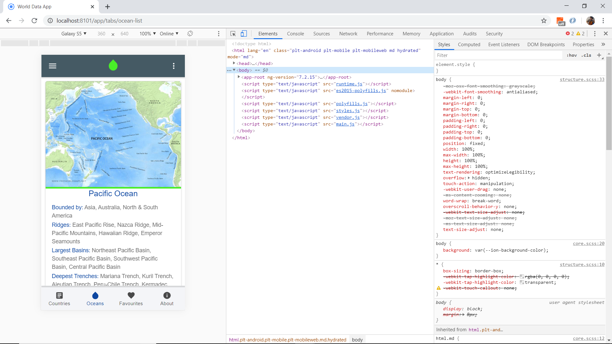
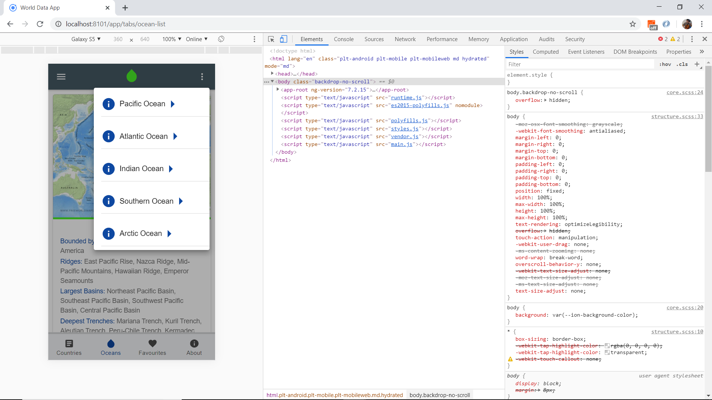

# Ionic Country Data

App that displays data about countries and oceans from the [Rest Countries](https://restcountries.eu/) API and a local json file. Built using the [Ionic 5 framework](https://ionicframework.com/docs).

## Table of contents

* [General info](#general-info)
* [Screenshots](#screenshots)
* [Technologies](#technologies)
* [Setup](#setup)
* [Features](#features)
* [Status](#status)
* [Inspiration](#inspiration)
* [Contact](#contact)

## General info

* The [Rest Countries API](https://restcountries.eu/) has a number of endpoints that can be used to search for info. I have used the endpoints: All, Name & Region. The (API Response Example)[https://restcountries.eu/#api-endpoints-response-example] was useful to create my http interface classes.

## Screenshots

|  |  |  |
|:---:|:---:|:---:|
| Countries Page French | Countries Page Spanish | Countries Page English |

|  |  |  |
|:---:|:---:|:---:|
| Oceans Page List | Oceans Page Popover| Oceans Page French |

|  |  |  |
|:---:|:---:|:---:|
| Favourites Page Empty | Favourites Page Some | Favourites Page Full |

|  |  |  |
|:---:|:---:|:---:|
| About Page French | About Page + Side Menu | About Page + Info Menu |






## Technologies

* [Ionic v5.0.0](https://ionicframework.com/)
* [Angular v7.2.2](https://angular.io/)
* [Ionic/angular v4.1.0](https://www.npmjs.com/package/@ionic/angular)
* [Rest Countries API v2.0.5](https://restcountries.eu/)
* [Ionic 4 open source Ionicons](https://ionicons.com/)

## Setup

* To start the server on _localhost://8100_ type: 'ionic serve'

## Code Examples

* service function to fetch API country details, from `rest-api.service.ts`

```typescript
fetchCountryDetailData(country: string) {
  return this.httpClient.get(`${apiUrl}/name/${country}?fullText=true`).pipe(
    map((data: CountryDetailInterface[]) => {
      return data;
    }), catchError( error => {
      return throwError( 'Country not found' );
    })  
  )
}
```

## Features

* **integrated Google Maps** API (future).
* **Typescript interface** used to define the expected structures of the json objects returned from the API.
* **Separate services** page with API http fetch functions.
* **RxJS Observables** used to extract data asynchronously.
* **Dark mode** switch on menu.
* **Offline Storage**  (future) of favourite articles using Ionic Storage.
* **Common Progess Bar Component**  (future) ion-card shows while country info loading.
* **Localisation using i18n**  (future) so user can select between English (default), Spanish and French.
* **ion-grid** with fixed column size used so country content data will display ok even on a PC.
* **search** function to search for country name with regex to only allow letters in search text.

## Navigation/Pages

* **Nav side-bar:** Working. countries, categories, favorites, search, about, change language, dark theme toggle + Unsplash image with credit. Languages added.
* **TODO** add language for alert cancel?

* **Countries page:** Working. Displays mat-card list of countries, displaying country flag, title, capital and region, for 'all' and 5 region sub-categories. Clicking on a country list item will show the country detail (no routing required - all done using *ngIf in the html content :-)). Country searchbar to search by country name.
* **TODO:** 
* Stop scroll when user reaches the bottom. 
* Add code so Map button will route to a (Google) Map view of the country.
* add function to convert border country 3 letter codes to full country names.
* add function (custom pipe) to insert ',' in area figures etc.

* **Oceans page** Working. Displays a mat-card for each ocean using data from a local json file and an *ngFor loop. Menu popover with links to further info for each ocean. It was decided not to add 'favourites functionality' as there are only 5 oceans and they are easy to find.
**TODO**
* Add Ionic accordian?

* **Favourites** Shows a nice image with text below if there are no favourites. 
**TODO**
* Add code to store/clear favourites.

* **About** Working. Displays Unsplash image with author credit and short info about the app with links to APIs used. Header includes popover with working links to Author Website, Github Repo & a contact page. 
**TODO** add code so contact form is sent.

## Status & To-do list

* Status: Working & deployed to Firebase. For To-do see sections above.

## Inspiration

* [Ionic Academy Tutorial: How to Localise Your Ionic App with ngx-translate](https://ionicacademy.com/localise-ionic-ngx-translate/) however language selected using ion-select-option dropdown list in side-menu (ie not using a popover page).

## Contact

Repo created by [ABateman](https://www.andrewbateman.org) - feel free to contact me!
