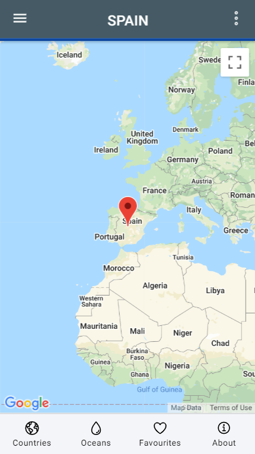

# :zap: Ionic Country Data

* Ionic app that displays data about countries and oceans from the [Rest Countries](https://restcountries.com/) API, Leaflet maps and a local JSON file.
**Note:** to open web links in a new window use: _ctrl+click on link_


## :page_facing_up: Table of contents

* [:zap: Ionic Country Data](#zap-ionic-country-data)
  * [:page\_facing\_up: Table of contents](#page_facing_up-table-of-contents)
  * [:books: General info](#books-general-info)
  * [:camera: Screenshots](#camera-screenshots)
  * [:signal\_strength: Technologies](#signal_strength-technologies)
  * [:floppy\_disk: Setup](#floppy_disk-setup)
  * [:computer: Code Examples](#computer-code-examples)
  * [:cool: Features](#cool-features)
  * [General/Navigation/Pages](#generalnavigationpages)
  * [:clipboard: Status \& To-do list](#clipboard-status--to-do-list)
  * [:clipboard: To-do](#clipboard-to-do)
  * [:clap: Inspiration](#clap-inspiration)
  * [:file\_folder: License](#file_folder-license)
  * [:envelope: Contact](#envelope-contact)

## :books: General info

* The [Rest Countries API v3](https://restcountries.com/) has a number of endpoints that can be used to search for info. I have used the endpoints: `All?fields=name,capital,region,flags`, Name & Region. The [API Response Example](https://restcountries.com/#api-endpoints-response-example) was useful to create my http interface class.
* [Leaflet maps](https://leafletjs.com/) displays a map of the chosen country that the user can zoom in and out of.
* [Angular KeyValuePipe](https://angular.io/api/common/KeyValuePipe) used to extract values from key-value pairs

## :camera: Screenshots

|  |  |  |
|:---:|:---:|:---:|
| Country-List Page | Country-List Page - Dark | Country-List - Detail |

|  |  |  |
|:---:|:---:|:---:|
| Map View Page | Side Menu | Side Menu - Dark |

|  |  |  |
|:---:|:---:|:---:|
| Oceans-List Page | Oceans Page - Dark| Oceans Page + Popover |

|  |  |  |
|:---:|:---:|:---:|
| Favourites Page | Favourites Page + Popover | Favourites Page - Dark |

|  |  |  |
|:---:|:---:|:---:|
| About Page | About Page + Popover | About Page - Dark |

## :signal_strength: Technologies

* [Ionic v7](https://ionicframework.com/)
* [Angular v16](https://angular.io/)
* [Ionic/angular v7](https://www.npmjs.com/package/@ionic/angular)
* [Rest Countries API v3](https://restcountries.com/) - v3 has a lot of breaking changes from v2
* [Leaflet maps](https://leafletjs.com/) JS library of maps
* [Ionic 5 open source Ionicons](https://ionicons.com/)

## :floppy_disk: Setup

* Run `npm i` to install dependencies
* `ionic serve` to start the server on `_localhost://8100_`
* To create a build file suitable for Firebase deployment: `ionic build --release`
* To deploy to Firebase: `firebase deploy`

## :computer: Code Examples

* service function to fetch API country details, from `rest-api.service.ts` using the take(1) method so unsubscribing from the observable is not necessary.

```typescript
fetchCountryDetailData(country: string): Observable<CountryDetailInterface[]> {
  return this.httpClient
    .get<CountryDetailInterface[]>(`${apiUrl}/name/${country}?fullText=true`)
    .pipe(
      take(1),
      catchError((error) => {
      return throwError('Country not found', error);
    })
  );
}
```

## :cool: Features

* **integrated Google Chart Maps** API to show country map.
* **Typescript interface** used to define the expected structures of the json objects returned from the API.
* **Separate services** page with API http fetch functions.
* **RxJS Observables** used to extract data asynchronously.
* **Dark mode** switch on menu.
* **Offline Storage**  (future) of favourite countries/oceans using Ionic Storage.
* **ion-grid** with fixed column size used so country content data will display ok even on a PC.
* **search** function to search for country name with regex to only allow letters in search text.

## General/Navigation/Pages

* **Nav side-bar:** countries, oceans, favorites, about, dark theme toggle.

* **Countries page:** Displays mat-card list of countries, displaying country flag, title, capital and region, for 'all' and 5 region sub-categories. Clicking on a country list item will show the country detail (no routing required - all done using *ngIf in the html content :-)). Country searchbar to search by country name. Fab icon link to map of country.
* **TODO:** add function (custom pipe) to insert ',' in area figures etc.

* **Oceans page** Displays a mat-card for each ocean using data from a local json file and an *ngFor loop. Menu popover with links to further info for each ocean. It was decided not to add 'favourites functionality' as there are only 5 oceans and they are easy to find.

* **Maps page** Displays Leaflet map of country and surrounding area with Capital in an offset tooltip
* **TODO:** Add boundary around country.

* **Favourites** Displays user favourites and popover allows them to be deleted. Shows an image with text below if there are no favourites
* **TODO:** Add sliding single favourite delete.

* **About** Displays image with author credit and short info about the app with links to APIs used. Header includes popover with working links to Author Website, Github Repo & author website contact page

## :clipboard: Status & To-do list

* Status: Working

## :clipboard: To-do

1. Progress bar - check it is working
2. Add eslinting - currently will not install due to rxjs version
3. Splash screen
4. SqLite - use as default database?
5. Lighthouse score?
6. Run on simulator

## :clap: Inspiration

* [Ionic Academy Tutorial: How to Localise Your Ionic App with ngx-translate](https://ionicacademy.com/localise-ionic-ngx-translate/) however language selected using ion-select-option dropdown list in side-menu (ie not using a popover page)
* [Devpato article: Setup Google Map in Angular app (The pro way)](https://dev.to/devpato/setup-google-map-in-angular-app-the-pro-way-3m9p)
* [ERROR Error: Database not created. Must call create() first](https://stackoverflow.com/questions/68378350/error-error-database-not-created-must-call-create-first)
* [What’s New in RxJS 7: Small Bundles and Big Changes to share()](https://www.bitovi.com/blog/whats-new-in-rxjs-7-small-bundles-and-big-changes-to-share)

## :file_folder: License

* This project is licensed under the terms of the MIT license.

## :envelope: Contact

* Repo created by [ABateman](https://github.com/AndrewJBateman), email: `gomezbateman@yahoo.com`
